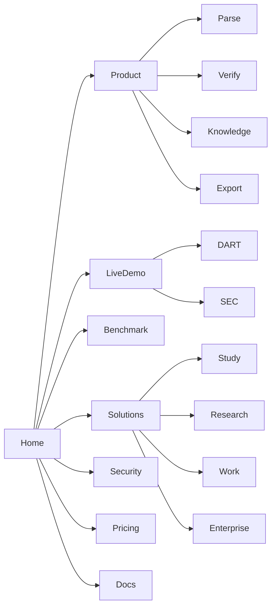

# AI Knowledge Compiler

## Enterprise Product UI/UX 최종 설계·구현 마스터플랜

> **Experience North Star**  
> 사용자는 문서를 블랙박스에 넣는 것이 아니라, 문서가 읽히고 검증되고 연결되어 **근거가 있는 AI 지식**으로 변하는 과정을 직접 보고 통제한다.

> **Visual North Star**  
> 마케팅에서는 문서가 3차원 공간에서 지식으로 컴파일되는 장면을 압도적으로 보여주고, 실제 작업 화면에서는 조용하고 정밀한 엔터프라이즈 도구처럼 동작한다.

---

# 0. 문서의 목적과 최종 의사결정

## 0.1 이 문서가 해결하는 것

이 문서는 다음 질문에 구현 가능한 수준으로 답한다.

- 랜딩을 어떻게 구성해야 첫 화면에서 차별성이 전달되는가
- 3D·모션·제품 시연 영상을 어디에, 어느 강도로 적용해야 하는가
- 일반 사용자와 엔터프라이즈 사용자가 같은 제품을 어렵지 않게 사용할 수 있는가
- 업로드부터 Markdown·Obsidian·온톨로지 출력까지 어떤 화면 흐름이 필요한가
- 처리 중 상태를 어떻게 시각화해야 신뢰와 전문성이 생기는가
- 원본 PDF와 결과 Markdown을 어떻게 양방향 검증하게 할 것인가
- 수백~수천 페이지와 수천 개 그래프 노드를 어떻게 성능 저하 없이 보여줄 것인가
- 디자인 토큰·컴포넌트·반응형·접근성·모션·성능 기준을 어떻게 고정할 것인가
- Figma와 코드가 서로 달라지는 문제를 어떻게 막을 것인가
- UI 완성도를 어떤 테스트와 출시 게이트로 검증할 것인가

## 0.2 최종 제품 경험 결정

### 채택

1. **Two-speed visual system**
   - Marketing layer: cinematic, expressive, 3D, scroll storytelling
   - Product layer: calm, dense, evidence-first, keyboard-friendly
2. **사용 목적 기반 온보딩**
   - 기술 포맷보다 “무엇을 하고 싶은가”를 먼저 묻는다.
3. **Quick Convert와 Knowledge Project를 분리**
   - 가벼운 사용자는 3단계 내 변환
   - 반복·다문서 사용자는 프로젝트 워크스페이스
4. **Processing Studio를 대표 제품 화면으로 채택**
   - 페이지 스트림 + 원본 오버레이 + Markdown/Knowledge 결과
5. **Review Studio는 issue-first로 설계**
   - 낮은 confidence가 아니라 위험도와 영향도 순으로 검토
6. **Knowledge Studio는 Notes·Graph·Entities·Relations·Evidence를 통합**
7. **3D는 랜딩과 최초 생성 순간에 집중**
   - 검토·편집 화면에서는 2D/WebGL과 절제된 모션 사용
8. **실제 백엔드 이벤트만 애니메이션에 연결**
9. **WCAG 2.2 AA를 제품 기본 목표로 채택**
10. **디자인 토큰을 코드의 단일 진실 원천으로 운영**

### 배제

- 보라색 그라데이션, 빛나는 AI 구체, 로봇, 뇌 이미지를 중심으로 한 일반적인 AI 랜딩
- 실제 처리와 무관한 스캔·타자기·진행률 연출
- 한 화면에 모든 기능과 그래프를 펼쳐 보여주는 방식
- 모바일에서 데스크톱 3열 화면을 축소만 하는 방식
- “98% 정확도”처럼 근거가 없는 단일 confidence 숫자
- 그래프를 예쁘게 보이게 하는 것만 목표로 한 3D knowledge graph
- 제품 내부에 기반 모델명을 과도하게 노출하는 방식
- 카드가 과도하게 많은 소비자용 대시보드 스타일
- 모든 상태를 색상만으로 구분하는 방식

## 0.3 최종 시각 방향

### 핵심 키워드

- Verifiable
- Precise
- Compiled
- Connected
- Calm power
- Transparent intelligence
- Enterprise trust

### 제품을 설명하는 시각적 메타포

```text
Document Pages
    ↓ Decompose
Typed Blocks
    ↓ Validate
Structured Markdown
    ↓ Compile
Knowledge Notes
    ↓ Connect
Evidence-backed Graph
```

AI의 상징을 직접 표현하지 않는다. **문서·구조·근거·연결** 자체가 브랜드 비주얼이 된다.

---

# 1. UI 리서치 결론

## 1.1 직접 경쟁 제품에서 가져올 것

| 레퍼런스 | 확인된 강점 | 우리 적용 | 그대로 복제하지 않을 부분 |
|---|---|---|---|
| Reducto Studio | 시각적 파이프라인, 원본·결과 비교, typed block·bbox·confidence | Processing Studio, source citation, pipeline mode | 개발자 중심 옵션 과밀, Knowledge workspace 부재 |
| Chunkr Web Interface | Task 중심 작업 목록, 처리 결과 전용 viewer, bbox 기반 품질 검사 | Jobs, Task detail, specialized viewer, usage/billing 연결 | 작업 후 결과가 파일 단위로 끝나는 경험 |
| Unstructured Platform | Source·Workflow·Job의 운영 객체 구분, failed file·cancel·retry | Enterprise workflow, run history, 실패 파일 운영 | 일반 사용자에게 노출되는 인프라 중심 용어 |
| Adobe Acrobat Compare | side-by-side, 연결된 highlight band, 차이 요약, next/previous issue | Review Studio, diff navigator, issue summary | PDF 버전 비교에 한정된 정보 구조 |
| Obsidian | Note·Wikilink·local/global graph, 그룹·필터, 노드 클릭 → 노트 | Knowledge Studio Notes·Local graph | 대형 그래프의 정보 과밀, provenance 부재 |
| Neo4j Bloom | Perspective, 검색 우선 subgraph, legend, detail card, 비개발자 탐색 | Ontology Explorer, query-driven graph, perspective filters | DB 탐색 용어와 전문성 과다 |

Reducto는 브라우저 기반 Studio에서 파싱·추출 파이프라인을 시각적으로 설정하고 실제 문서로 시험한 뒤 배포하도록 구성한다.[R01] Chunkr는 Tasks 탭과 목적별 viewer를 통해 코드 없이 결과 품질을 검사하는 흐름을 제공한다.[R03] Adobe Acrobat은 차이 요약과 side-by-side 연결 하이라이트, 변경 유형 필터, 다음 변경 탐색을 제공한다.[R10] 이 세 패턴을 결합하면 우리 Review Studio의 핵심 구조가 된다.

## 1.2 엔터프라이즈 SaaS에서 가져올 것

| 레퍼런스 | 가져올 원칙 | 적용 위치 |
|---|---|---|
| Linear 2026 UI refresh | 일관된 header·navigation·view control, 차분한 sidebar, main content 강조 | 전체 app shell |
| Vercel 2026 Dashboard | resizable sidebar, team/project 문맥 통합, mobile bottom bar, 고밀도 list | workspace navigation, project filter, mobile app shell |
| Carbon Design System | role-based token, productive typography, 데이터 테이블, batch action | 디자인 토큰, enterprise table, admin UI |
| Radix Primitives | focus management, keyboard navigation, accessible semantics | 기본 interactive component |
| React Aria | 국제화·RTL·날짜·숫자 입력, 접근성 behavior | 복잡 form·locale aware control |

Linear는 2026년 refresh에서 workflow 전반의 header와 view control을 일관되게 만들고 sidebar를 더 어둡고 차분하게 조정해 main content에 초점을 주었다.[R05] Vercel은 2026년 dashboard navigation을 resizable sidebar로 통합하고 project를 filter처럼 전환하며 mobile에는 한 손 조작용 floating bottom bar를 적용했다.[R06] 우리 앱은 이 두 패턴을 기본 app shell로 사용한다.

## 1.3 지식 그래프에서 가져올 것

Neo4j Bloom의 핵심은 전체 그래프를 무조건 펼치는 것이 아니라 검색·Perspective로 필요한 subgraph를 먼저 찾고, Scene·Legend·Card list로 탐색하는 것이다.[R12] Obsidian은 global graph와 active note 중심 local graph를 분리하며 검색·group·depth를 조절한다.[R11]

### 최종 결정

- 사용자 기본 화면은 **Local/Query Graph**
- 전체 그래프는 별도 `Global map` 탭
- 1,500개 이상 노드는 자동 clustering
- 10,000개 이상은 query subgraph만 허용
- 그래프를 사용할 수 없는 사용자에게 동일한 내용을 Table/Tree로 제공
- 노드·관계 클릭 시 Evidence panel이 항상 열린다.

## 1.4 3D·모션 레퍼런스 결론

Spline은 interactive 3D를 web·React·Next.js 등에 바로 임베드할 수 있는 production-ready workflow를 제공한다.[R15] Rive는 작은 파일과 open-source runtime, state machine 기반 제어를 제공하며 idle 상태에서 계산을 멈추는 settle 동작을 지원한다.[R16][R17]

### 최종 기술 배분

| 목적 | 기본 선택 | 이유 |
|---|---|---|
| 랜딩 Hero 3D | Spline 우선, React Three Fiber 대안 | 제작 속도·디자인 협업·웹 임베드 |
| 제품 데모 상태 애니메이션 | Rive | backend event → state machine 매핑 |
| 일반 UI transition | Motion/CSS | 가벼운 component motion |
| Knowledge graph | Sigma.js stable + Graphology | WebGL 대형 그래프 성능 |
| 온톨로지 편집·workflow editor | React Flow | node-based editing·keyboard support |
| 긴 페이지·로그 목록 | TanStack Virtual | virtualized rendering |

## 1.5 시장 UI의 빈틈

현재 주요 문서 처리 제품은 다음을 잘한다.

- parse/extract pipeline
- task management
- source bounding box
- JSON schema extraction
- API integration
- enterprise security

그러나 다음이 한 제품 안에서 강하게 연결된 경험은 드물다.

1. 변환 과정을 실제 이벤트로 시각화
2. 원문 → Markdown → Knowledge Note → Ontology 관계까지 같은 evidence chain으로 탐색
3. 일반 사용자가 결과를 Obsidian Vault로 이해하고 수정
4. 공개 benchmark와 실제 결과를 같은 UI에서 검증
5. 여러 문서가 새 지식베이스로 합쳐지는 과정을 시각화

이 다섯 가지가 UI 차원의 제품 해자다.

---

# 2. 제품 경험 전략

## 2.1 사용자 유형

### Persona A — Quick Converter

- PDF 몇 개를 ChatGPT·Claude·NotebookLM에 넣고 싶음
- Markdown·온톨로지 용어를 잘 모름
- 빠른 결과와 쉬운 다운로드를 원함

### Persona B — Knowledge Worker

- 논문·교재·업무자료를 Obsidian에 정리
- 링크·MOC·메타데이터 품질에 민감
- 결과를 수정하고 지속적으로 자료를 추가

### Persona C — Developer

- API·JSONL·RAG chunk·citation이 필요
- 정확도·latency·cost·schema compliance를 비교
- batch processing과 webhook을 사용

### Persona D — Enterprise Operator

- 팀·RBAC·SSO·retention·region·audit가 중요
- 대량 작업 실패와 재시도, 비용 예측을 관리
- 외부 모델 전송 정책을 통제

### Persona E — Reviewer / Analyst

- OCR·숫자·표·관계 오류를 검수
- issue queue와 keyboard shortcut 필요
- 수정 이력과 책임자를 기록

## 2.2 Jobs-to-be-Done

```text
내 자료를 AI가 읽기 쉽게 만들고 싶다.
내 자료가 정확히 변환됐는지 직접 확인하고 싶다.
여러 자료를 하나의 연결된 지식베이스로 만들고 싶다.
내가 사용하는 도구로 바로 내보내고 싶다.
기업 문서를 외부에 노출하지 않고 처리하고 싶다.
```

## 2.3 Progressive Disclosure

초기 화면에서 모델·OCR·RAG·온톨로지를 설명하지 않는다.

### Level 1 — 일반 사용자

- 빠르게 변환
- AI용으로 정리
- Obsidian으로 정리
- 여러 자료 연결

### Level 2 — 고급 사용자

- Fast / Balanced / Precision
- source citation
- chunk profile
- schema profile

### Level 3 — 개발자·관리자

- provider route
- parser revision
- event log
- GPU seconds
- benchmark metrics
- webhook payload

## 2.4 제품 모드

| 모드 | 사용자 설명 | 핵심 화면 | 기본 출력 |
|---|---|---|---|
| Quick Convert | 문서를 깔끔한 AI용 파일로 | Upload → Processing → Result | Markdown ZIP |
| Knowledge Project | 여러 자료를 연결된 지식으로 | Project → Processing → Knowledge Studio | Vault + RAG |
| Precision Review | 중요한 문서를 정밀 검토 | Processing → Review Studio | Verified package |
| Developer Pipeline | API·schema·webhook | Workflow → Job → Output | JSON/JSONL |
| Enterprise Private | 정책 통제된 전용 처리 | Admin + Projects | private outputs |

---

# 3. 브랜드와 시각 정체성

## 3.1 브랜드 포지셔닝

### 외부 표현

> **Documents in. Verifiable knowledge out.**

한국어:

> **모든 문서를, 검증 가능한 AI 지식으로.**

### 제품 카테고리 표현

- AI Knowledge Compiler
- Document Intelligence Workspace
- Verifiable Knowledge Infrastructure

### 피해야 할 표현

- 단순 OCR
- PDF 변환기
- 자체 파운데이션 모델
- AI가 100% 정확하게 변환

## 3.2 로고 방향

최종 브랜드명이 확정되지 않았으므로 symbol system만 정의한다.

### 권장 심벌

- 겹쳐진 3장의 문서 plane
- 중앙 plane이 Markdown block으로 분해
- 바깥 두 점이 edge로 연결
- 작은 크기에서는 `fold + node`만 남김

### 금지

- 뇌
- 로봇 얼굴
- 마법봉·반짝이 중심
- 무한대 기호
- 일반적인 육각형 AI chip

## 3.3 시각 문법

### Page plane

원본 문서·페이지를 표현한다.

### Typed block

heading, paragraph, table, figure, formula를 표현하는 얇은 rectangular object다.

### Provenance thread

결과와 원본을 연결하는 1px 또는 1.5px line이다. 브랜드의 고유한 시각 자산으로 사용한다.

### Knowledge node

최종 지식 단위를 나타내며 원형보다 모서리가 둥근 squircle 또는 compact card를 기본으로 한다.

### Verification mark

체크 아이콘 하나가 아니라 source coverage·numeric check·table check를 조합한 evidence seal로 표현한다.

## 3.4 전체 미학

```text
Marketing: 60% white editorial + 25% cinematic 3D + 15% product UI
Product:   75% calm neutral + 20% data/evidence + 5% brand motion
```

---

# 4. 디자인 토큰

## 4.1 토큰 운영 원칙

Carbon은 color·spacing·typography·global token을 역할 기반으로 분리해 theme 전체를 일관되게 유지한다.[R21] Tailwind CSS v4는 design token을 CSS custom property로 노출할 수 있다.[R28]

우리도 raw hex를 component에 직접 쓰지 않는다.

```text
Primitive token → Semantic token → Component token
```

예:

```text
blue-600 → action-primary → button-primary-bg
```

## 4.2 기본 컬러 팔레트

### Neutral

| Token | Hex | 용도 |
|---|---|---|
| `neutral-0` | `#FFFFFF` | primary surface |
| `neutral-25` | `#FCFCFD` | subtle canvas |
| `neutral-50` | `#F7F8FA` | app background |
| `neutral-100` | `#F2F4F7` | secondary surface |
| `neutral-200` | `#E4E7EC` | border subtle |
| `neutral-300` | `#D0D5DD` | border strong |
| `neutral-500` | `#667085` | tertiary text |
| `neutral-600` | `#475467` | secondary text |
| `neutral-800` | `#1D2939` | strong text |
| `neutral-900` | `#101828` | primary text |
| `neutral-950` | `#0B1020` | dark canvas |

### Brand — Compiler Blue

| Token | Hex | 용도 |
|---|---|---|
| `brand-50` | `#EEF2FF` | selected background |
| `brand-100` | `#E0E7FF` | hover subtle |
| `brand-300` | `#A5B4FC` | decorative |
| `brand-500` | `#4C6FFF` | graphic accent |
| `brand-600` | `#3157E0` | primary action |
| `brand-700` | `#2446C8` | active/pressed |
| `brand-900` | `#182A7A` | dark text/accent |

`brand-600`은 white에서 일반 text 수준의 대비를 확보하므로 primary button과 link에 사용 가능하다. 실제 구현에서는 automated contrast test를 통과해야 한다.

### Secondary — Evidence Teal

| Token | Hex | 용도 |
|---|---|---|
| `evidence-50` | `#ECFDF9` | evidence surface |
| `evidence-500` | `#12B8A6` | provenance accent |
| `evidence-700` | `#0F766E` | accessible evidence text |

### AI-derived — Violet

AI 결과는 브랜드 전체가 아니라 origin 표시에서만 사용한다.

| Token | Hex |
|---|---|
| `ai-50` | `#F5F3FF` |
| `ai-600` | `#7C3AED` |
| `ai-800` | `#5B21B6` |

### Semantic

| 역할 | Hex |
|---|---|
| success | `#067647` |
| warning | `#B54708` |
| danger | `#B42318` |
| info | `#1570EF` |

## 4.3 Semantic token

```css
:root {
  --bg-app: #F7F8FA;
  --bg-surface: #FFFFFF;
  --bg-surface-subtle: #F2F4F7;
  --bg-elevated: #FFFFFF;

  --text-primary: #101828;
  --text-secondary: #475467;
  --text-tertiary: #667085;
  --text-inverse: #FFFFFF;

  --border-subtle: #E4E7EC;
  --border-default: #D0D5DD;
  --border-strong: #98A2B3;

  --action-primary: #3157E0;
  --action-primary-hover: #2446C8;
  --action-secondary-bg: #FFFFFF;
  --action-secondary-border: #D0D5DD;

  --evidence: #0F766E;
  --ai-derived: #7C3AED;
  --success: #067647;
  --warning: #B54708;
  --danger: #B42318;
}
```

## 4.4 Dark theme

Dark theme는 출시 필수 기능이 아니라 **제품 사용 시간이 긴 사용자용 SHOULD**다.

- 원본 PDF surface는 흰색 유지 옵션 제공
- Markdown preview는 dark 가능
- graph는 dark에서 대비가 더 좋을 수 있음
- marketing은 light를 기본으로 유지

## 4.5 Typography

### Font stack

```css
--font-ui: "Pretendard Variable", "Inter", "Noto Sans KR", system-ui, sans-serif;
--font-mono: "JetBrains Mono", "SFMono-Regular", Consolas, monospace;
--font-editorial: "Pretendard Variable", "Inter", sans-serif;
```

폰트 파일은 라이선스 확인 후 self-host하고 `next/font` 또는 동일한 layout-shift 방지 방식으로 로드한다. 외부 CDN 폰트 요청은 기업 보안·성능 이유로 피한다.

### Product type scale

| Token | Size / line | Weight | 용도 |
|---|---:|---:|---|
| `label-xs` | 11 / 16 | 500 | dense metadata |
| `label-sm` | 12 / 16 | 500 | chip, field label |
| `body-sm` | 13 / 20 | 400 | dense table, secondary |
| `body-md` | 14 / 22 | 400 | product body |
| `body-lg` | 16 / 24 | 400 | readable preview |
| `title-sm` | 16 / 24 | 600 | panel title |
| `title-md` | 20 / 28 | 600 | page title |
| `title-lg` | 28 / 36 | 600 | product section |

### Marketing type scale

| Token | Desktop | Mobile |
|---|---:|---:|
| Hero | 64/68, 650 | 40/46, 650 |
| Section headline | 48/56 | 32/40 |
| Lead | 20/32 | 18/28 |
| Body | 16/28 | 16/26 |

### CJK 규칙

- 제목 letter-spacing은 `-0.02em` 이하로 과도하게 줄이지 않는다.
- 본문 `word-break: keep-all`, 좁은 panel에서는 `overflow-wrap: anywhere`를 선택적으로 사용한다.
- 숫자 비교·재무 표에는 `font-variant-numeric: tabular-nums` 적용
- 모델명·hash·접수번호는 mono font 사용

## 4.6 Spacing

4px base grid.

```text
2, 4, 6, 8, 12, 16, 20, 24, 32, 40, 48, 64, 80, 96, 128
```

- dense product component: 4–12px
- panel padding: 16–20px
- page content gutter: 24–32px
- marketing section: 96–160px

## 4.7 Radius

| Token | Value | 용도 |
|---|---:|---|
| `radius-xs` | 4px | tiny status, code |
| `radius-sm` | 6px | input, compact button |
| `radius-md` | 8px | product cards, dialog |
| `radius-lg` | 12px | large panel |
| `radius-xl` | 16px | marketing demo frame |
| `radius-pill` | 999px | tag only |

과도한 20–32px rounded card는 피한다. 엔터프라이즈 앱은 6–12px가 기본이다.

## 4.8 Elevation

border와 layer contrast를 우선한다.

```css
--shadow-xs: 0 1px 2px rgba(16,24,40,.05);
--shadow-sm: 0 2px 8px rgba(16,24,40,.07);
--shadow-md: 0 12px 28px rgba(16,24,40,.12);
--shadow-float: 0 20px 48px rgba(16,24,40,.16);
```

- fixed sidebar·panel에는 shadow 금지, border 사용
- popover·command palette만 `shadow-md`
- marketing floating product frame에만 큰 shadow

## 4.9 Iconography

- 기본 16px, 주요 action 18px, marketing 20–24px
- stroke 1.75px
- 동일 아이콘에 서로 다른 의미 부여 금지
- icon-only button에는 tooltip과 accessible name 필수
- AI origin은 sparkle 대신 `branch`, `wand`를 제한적으로 사용

---

# 5. Layout system

## 5.1 Breakpoints

| 이름 | Width | 주요 대응 |
|---|---:|---|
| `xs` | 360 | 최소 모바일 |
| `sm` | 640 | 큰 모바일 |
| `md` | 768 | 태블릿 portrait |
| `lg` | 1024 | 태블릿 landscape / small desktop |
| `xl` | 1280 | desktop |
| `2xl` | 1440 | primary design canvas |
| `3xl` | 1920 | wide enterprise monitor |

## 5.2 Marketing grid

- max width: 1280px
- 12 columns
- gutter: 24px desktop, 16px mobile
- page margin: 32px desktop, 20px mobile
- full-bleed hero visual은 1600px까지 허용

## 5.3 Product app shell

```text
┌──────────────────────────────────────────────────────────────┐
│ Global top bar 48                                            │
├──────────────┬───────────────────────────────────────────────┤
│ Sidebar      │ Context header 48                             │
│ 256 / 64     ├───────────────────────────────────────────────┤
│              │ Main workspace                                │
│              │                                               │
└──────────────┴───────────────────────────────────────────────┘
```

### Dimensions

- Global top bar: 48px
- Expanded sidebar: 248px or 256px
- Collapsed sidebar: 56px or 64px
- Context header: 48px
- Standard inspector: 360px
- Wide inspector: 440–520px
- Minimum main workspace: 640px

### Wide monitor

1920px 이상에서는 content를 무조건 중앙 좁은 column에 가두지 않는다. Processing·Review·Table은 폭을 적극 사용한다.

## 5.4 Resizable panel

- left page navigator: 184–300px
- center source: min 420px
- right result: 360–720px
- double-click divider → default size
- panel size는 user/workspace별 저장
- keyboard resize 지원

## 5.5 Density

- `Comfortable`: 일반 사용자, 44–48px row
- `Compact`: developer/enterprise, 32–36px row
- user setting과 page-level toggle 제공

Carbon data table은 compact부터 tall까지 row size를 구분하고 toolbar·header와 일관된 높이를 권장한다.[R22] 우리 table도 density token을 사용한다.

---

# 6. Marketing site information architecture



## 6.1 Global navigation

### Desktop

```text
Logo | Product | Solutions | Demo | Benchmark | Security | Pricing | Docs | Sign in | Start free
```

### Mobile

- Logo
- `Start free`
- menu
- sticky bottom CTA는 landing 최하단 40% 구간에서만 사용

## 6.2 Navigation behavior

- transparent hero → scroll 후 opaque white
- height 64px
- product dropdown은 기능명이 아니라 사용자 outcome 중심
- `Start free`는 한 페이지에 primary CTA 1개 원칙
- `Demo`는 로그인 없이 진입

---

# 7. Landing page 상세 설계

## 7.1 Hero

### Layout

```text
┌───────────────────────────────────────────────────────────────┐
│ NAV                                                           │
├────────────────────────────┬──────────────────────────────────┤
│ Headline                   │ Interactive 3D                   │
│ Lead                       │ PDF → blocks → MD → graph        │
│ CTA primary / secondary    │                                  │
│ Trust strip                │                                  │
└────────────────────────────┴──────────────────────────────────┘
```

- viewport: 760–900px desktop
- copy: 5 columns
- visual: 7 columns
- headline max 720px
- CTA above fold

### Copy

```text
모든 문서를,
검증 가능한 AI 지식으로.

PDF·보고서·논문·강의자료를 원문 근거가 연결된 Markdown,
Obsidian Vault, RAG 데이터, 지식 그래프로 변환합니다.
```

Primary CTA: `내 문서로 시작하기`  
Secondary CTA: `실제 변환 과정 보기`

### Trust strip

```text
원문 근거 연결 · 실시간 처리 공개 · 외부 AI 전송 선택 · 자동 삭제 설정
```

## 7.2 Hero 3D scene

### Scene composition

1. foreground: 3–5 PDF page planes
2. middle: typed blocks floating in reading order
3. center: Markdown surface with heading/table
4. background: 8–12 knowledge nodes and evidence edges
5. scanning light travels only after pointer or scripted intro

### Interaction

- pointer parallax: max 3°
- scroll 0–20%: page spread
- scroll 20–45%: block extraction
- scroll 45–70%: Markdown assembly
- scroll 70–100%: graph connection
- CTA focus 또는 keyboard 사용 시 motion 없이 final state 제공

### Performance budget

- hero copy와 CTA는 WebGL보다 먼저 렌더
- 3D module lazy load
- initial 3D compressed transfer target: ≤1.5MB
- mobile low-memory: 2D Rive 또는 video poster fallback
- hidden tab·out-of-viewport: pause render loop
- 30fps도 충분한 idle scene, interaction 시 60fps 목표
- WebGL failure → static SVG/PNG fallback

## 7.3 Social proof와 product truth

사용자 로고가 충분히 없을 때 가짜 logo wall을 만들지 않는다.

대신 다음을 보여준다.

- 지원 출력 프로필
- benchmark dataset
- source-linked demo
- open-source notices
- processing security

## 7.4 Scroll Transformation Story

### Section 1 — Read the page

- sticky original PDF
- heading·table·figure bbox가 backend-like sequence로 표시
- copy: “텍스트만 읽지 않습니다. 구조와 읽기 순서를 복원합니다.”

### Section 2 — Verify the result

- 원본 숫자와 Markdown 숫자 연결
- 표 cell mapping
- issue badge
- copy: “결과마다 원문 근거를 연결합니다.”

### Section 3 — Compile knowledge

- 하나의 보고서가 notes로 분해
- company/risk/metric nodes 연결
- copy: “파일을 쌓는 대신, 재사용 가능한 지식 단위로 컴파일합니다.”

### Section 4 — Export anywhere

- Markdown, Obsidian, RAG, JSON-LD cards
- 실제 sample tree 표시
- copy: “하나의 원본에서 목적별 패키지를 생성합니다.”

## 7.5 Interactive product demo

로그인 없이 미리 처리한 샘플을 직접 탐색하게 한다.

Tabs:

- Korea DART
- US SEC
- Research paper
- Lecture deck

Layout:

```text
[Source] [Markdown] [Knowledge Graph]
```

Interactions:

- Source table click → Markdown table focus
- Markdown paragraph click → source bbox
- Graph node click → source evidence drawer
- “Show how it was verified” → numeric/table/source checks

## 7.6 Product video

### 35–45초 storyboard

| Time | Scene |
|---:|---|
| 0–4s | PDF drag-and-drop |
| 4–10s | preflight: text/OCR/table pages classified |
| 10–18s | page stream, bbox, block Markdown generation |
| 18–25s | paragraph click → source evidence |
| 25–32s | Obsidian notes and links generated |
| 32–39s | graph query and evidence panel |
| 39–45s | export package + CTA |

### Video rules

- actual product UI only
- autoplay muted, no sound requirement
- captions and transcript
- poster image mandatory
- scroll into viewport 후 재생
- reduced motion에서는 auto-play 금지

## 7.7 Benchmark section

```text
한국어 DART · US SEC · 복잡한 표 · 스캔 · 장문
```

보여줄 것:

- text accuracy
- numeric accuracy
- table structure
- source coverage
- processing cost/time

보여주지 않을 것:

- 맥락 없는 평균 하나
- 공식 모델 점수를 우리 점수처럼 표현
- test set 구성 없는 “업계 1위” 문구

## 7.8 Security section

카드 4개가 아니라 실제 control UI preview를 보여준다.

- retention policy selector
- processing region
- external provider off
- audit event

## 7.9 Pricing

- Free / Pro / Team / Enterprise
- technical credit보다 monthly outcome 먼저
- `Fast pages`, `Precision credits`, `Knowledge projects` 구분
- preflight estimator demo
- overage와 storage retention을 명시

## 7.10 Footer

- Product
- Solutions
- Developers
- Company
- Legal
- Third-party notices
- Status
- Trust center

---

# 8. 공개 DART·SEC showcase

## 8.1 목적

DART와 SEC는 금융 서비스로 포지셔닝하기 위한 것이 아니라 **복잡한 한글·영문 문서를 검증 가능한 지식으로 바꾸는 기술 증명**이다.

## 8.2 Showcase landing

```text
DART 사업보고서 420페이지
↓
Markdown 1개 + Knowledge notes 84개 + Relations 231개
↓
숫자 3,842개 검증 · 표 52개 구조 검사 · Evidence coverage 99.x%
```

## 8.3 화면

1. Filing selector
2. Original filing
3. Markdown
4. Company vault
5. Ontology explorer
6. Benchmark report

## 8.4 Graph preset

- Company
- Filing
- Metric
- Segment
- Subsidiary
- Risk
- Correction
- Evidence Block

## 8.5 Legal/product disclaimer

```text
본 데모는 문서 처리 기술 시연이며 투자 조언 또는 공시 내용의 경제적 정확성 검증이 아닙니다.
```

---

# 9. Authentication·Onboarding

## 9.1 Sign up

- email magic link 또는 OAuth
- enterprise SSO는 별도
- 첫 가입 단계에서 결제 요구 금지
- sample demo를 먼저 사용할 수 있게 함

## 9.2 Goal onboarding

질문 1:

```text
자료를 무엇에 사용하시나요?
```

- AI에게 질문하기
- Obsidian에 정리하기
- Markdown으로 변환하기
- 여러 자료를 연결하기
- 개발 API에 사용하기

질문 2:

```text
주로 어떤 자료를 처리하시나요?
```

- PDF·보고서
- 논문·교재
- PPT·강의자료
- 계약서·업무문서
- 혼합 자료

질문 3:

```text
보안 설정
```

- 표준 클라우드 처리
- 외부 AI 호출 안 함
- 처리 후 자동 삭제 기간

## 9.3 First success

가입 후 설정 페이지로 보내지 않는다.

```text
Sample document → 30초 processing preview → result
```

그 다음 실제 업로드 CTA를 제공한다.

---

# 10. Product app information architecture

```text
Workspace
├── Home
├── Projects
│   └── Project
│       ├── Documents
│       ├── Jobs
│       ├── Knowledge
│       ├── Review
│       └── Exports
├── Quick Convert
├── Knowledge Bases
├── Benchmarks
├── API & Workflows
├── Usage
└── Settings
    ├── Members
    ├── Security
    ├── Retention
    ├── Integrations
    ├── Billing
    └── Audit Log
```

## 10.1 App shell

### Global top bar

- workspace switcher
- global search / command palette
- processing activity indicator
- help
- notifications
- account

### Sidebar

```text
Home
Projects
Quick Convert
Knowledge Bases
Benchmarks
API & Workflows

Usage
Settings
```

### Context header

- breadcrumb
- page title
- status
- primary action
- view controls

## 10.2 Command palette

Shortcut: `⌘K / Ctrl+K`

- Open project
- Upload files
- Go to issue
- Search entity
- Export
- Switch workspace
- Run benchmark
- Open source page

---

# 11. Home Dashboard

## 11.1 목적

대시보드는 vanity KPI가 아니라 **다음 행동**을 빠르게 결정하게 한다.

## 11.2 Layout

```text
[New upload] [Create knowledge project]

Processing now
- 3 active jobs

Needs attention
- 2 review-required documents
- 1 failed page group

Recent projects
- table/list

Usage
- credits, storage, retention
```

## 11.3 KPI

보여줄 것:

- active jobs
- review required
- pages processed this cycle
- storage used
- credit remaining

보여주지 않을 것:

- 의미 없는 총 문서 수를 hero number로 과도하게 강조
- 정밀하지 않은 “평균 정확도”

## 11.4 Recent project table

Columns:

- Project
- Documents
- Status
- Last activity
- Review issues
- Output
- Owner

- row click → project
- checkbox → bulk export/delete
- inline action은 max 2개, 나머지 overflow

---

# 12. Upload & Preflight

## 12.1 Upload surface

```text
Drag files or folders
PDF · DOCX · PPTX · XLSX · Images · HTML
```

- file picker
- folder upload
- cloud import는 후속
- paste URL은 security check 후

## 12.2 Upload progress

각 파일 단위로:

- hashing
- upload
- security scan
- metadata extraction
- ready

중단 후 resume 가능.

## 12.3 Preflight result

```text
82 pages
56 native text pages
21 OCR pages
5 complex table/formula pages
Estimated 34–42 credits
Expected 2–5 min
```

## 12.4 Mode selector

### 사용자 UI

- Fast
- Balanced — Recommended
- Precision
- Private

### 설명

- Fast: 빠른 변환, 일반 디지털 문서
- Balanced: 대부분 문서에 권장
- Precision: 복잡 표·저화질·중요 문서
- Private: 외부 provider 호출 금지

## 12.5 Output goal

- Clean Markdown
- Obsidian Vault
- AI/RAG package
- Knowledge Graph

`Advanced`에서만 chunk/schema 설정을 보여준다.

## 12.6 Credit confirmation

```text
Estimated 38 credits
Reserved maximum 48 credits
Unused reservation is returned automatically.
```

## 12.7 Edge cases

- password-protected PDF
- corrupt file
- unsupported embedded media
- very large workbook
- duplicate file
- no extractable content
- malware suspicion

각 상태는 이유·해결법·refund 정책을 함께 표시한다.

---

# 13. Processing Studio — 대표 제품 화면

## 13.1 Desktop layout

```text
┌────────────────────────────────────────────────────────────────────────────┐
│ Breadcrumb | Document title | Balanced | 43/120 | Cancel | More            │
├────────────────────────────────────────────────────────────────────────────┤
│ Upload ✓  Preflight ✓  Parse ●  Normalize ◐  Knowledge ○  Validate ○       │
├───────────────┬────────────────────────────────┬───────────────────────────┤
│ Page stream   │ Source viewer                  │ Live result               │
│ 220 px        │ flexible                       │ 440 px                    │
│               │ bbox / text / table overlay    │ Markdown / Blocks / Log   │
├───────────────┴────────────────────────────────┴───────────────────────────┤
│ Metrics tray: route · table · issue · credits · GPU · queue · event log    │
└────────────────────────────────────────────────────────────────────────────┘
```

## 13.2 Context header

- breadcrumb
- file name editable
- current route profile
- pages done / total
- processing elapsed
- cancel
- pause if supported
- action menu

## 13.3 Stage rail

- horizontal, 40px
- actual stage count and weighted progress
- click completed stage → detail
- upcoming stage read-only
- stage error → red icon + recovery action

## 13.4 Page stream

### Thumbnail card

```text
[thumbnail]
P.12       OCR
Table 2    Review 1
```

### States

- queued
- rendering
- native extracting
- OCR running
- normalizing
- validating
- completed
- review required
- retrying
- failed

### Visual

- active: brand border 2px
- complete: subtle success dot
- review: amber triangle + count
- failed: danger + retry
- route badge는 secondary text

### Interaction

- virtual scroll
- filter: All / Processing / Review / Failed
- search page number
- multi-select for retry
- keyboard `J/K`, `G P`

## 13.5 Source viewer

### Toolbar

- page number
- zoom
- fit width / fit page
- rotate
- overlay toggle
- text layer toggle
- issue toggle
- compare candidate
- full screen

### Overlay

Block type:

- heading
- paragraph
- list
- table
- figure
- formula
- header/footer
- footnote

Overlay style:

- default border 1px
- selected 2px
- fill alpha 4–8%
- label only on hover/selection
- many boxes appear simultaneously when zoomed out: labels hidden

### Provenance interaction

- source block hover → result block highlight
- click → pin connection
- selected pair connected by a thin provenance thread across panels
- `Esc` unpins

## 13.6 Live result

Tabs:

- Markdown
- Blocks
- Events

### Markdown

- completed block 단위 append
- auto-follow only when user is at bottom
- user scroll up → `Jump to latest` button
- processing block has skeleton, not fake text typing
- source chip on every block hover

### Blocks

structured list:

- type
- text preview
- origin
- status
- source page

### Events

advanced mode only:

- human-readable event
- timestamp
- technical detail expandable

## 13.7 Metrics tray

Collapsed default.

- Native/OCR/Fallback pages
- Tables/Figures/Formulas
- Review issue count
- Used/reserved credits
- GPU seconds
- current queue position
- last event

## 13.8 Event → animation mapping

| Event | Visual behavior |
|---|---|
| `page_render_started` | thumbnail shimmer + source blank |
| `layout_detected` | bbox enters with 140ms fade/scale 0.98→1 |
| `block_parsed` | corresponding block appears in result |
| `table_reconstructed` | grid line resolves, then Markdown table appears |
| `quality_warning` | issue marker pulses once, no infinite animation |
| `route_escalated` | route chip changes and short thread moves to Precision lane |
| `page_completed` | thumbnail state locks to completed |
| `knowledge_note_created` | background node appears only in Knowledge mini-map |

## 13.9 Cold start UX

```text
정밀 인식 엔진을 준비하고 있습니다.
문서는 안전하게 업로드되었으며 준비가 끝나면 자동으로 시작됩니다.
```

- estimated queue position
- cancel without charge if no inference started
- technical log hidden

## 13.10 Partial completion

작업 전체를 실패로 표시하지 않는다.

```text
117/120 pages complete
2 pages need review
1 page failed after 3 retries
```

Actions:

- Download completed result
- Retry failed pages
- Continue without failed pages
- Contact support with job ID

## 13.11 Mobile

Tabs:

- Progress
- Pages
- Source
- Result
- Review

- bottom action bar
- source-result split disabled
- selected block의 evidence를 bottom sheet로 표시
- heavy overlay editing read-only

---

# 14. Review Studio

## 14.1 기본 원칙

Review Studio는 문서를 처음부터 다시 읽게 하는 화면이 아니다. **가장 위험한 불확실성만 빠르게 해결**하게 한다.

## 14.2 Layout

```text
┌───────────────┬────────────────────────────┬─────────────────────────────┐
│ Issue queue   │ Source                     │ Candidate / Result          │
│ 320 px        │                            │ 440 px                      │
│ Severity      │ highlighted bbox           │ A/B/current + actions       │
└───────────────┴────────────────────────────┴─────────────────────────────┘
```

## 14.3 Issue types

1. Numeric mismatch
2. Table structure mismatch
3. Missing mandatory/warning text
4. Reading order
5. Heading hierarchy
6. Low resolution
7. OCR disagreement
8. Source coverage missing
9. AI inference unsupported
10. Broken Markdown

## 14.4 Issue card

```text
Critical · Numeric mismatch
Page 42 · Table 3 · 2 values
“12,345,678” vs “12,345,673”
```

- severity
- category
- page/block
- impact summary
- evidence count
- owner/status

## 14.5 Candidate compare

- Current result
- Candidate A
- Candidate B
- Native text if available

차이는 character·number·cell 단위로 강조한다.

## 14.6 Actions

- Accept current
- Choose candidate A/B
- Edit manually
- Reprocess page
- Mark source unreadable
- Ignore with reason
- Apply rule to similar issues

## 14.7 Keyboard

- `J/K`: next/previous issue
- `1/2/3`: candidate selection
- `E`: edit
- `R`: retry
- `A`: accept
- `Shift+A`: bulk apply

## 14.8 Review status

- Open
- In review
- Resolved
- Accepted risk
- Source unreadable

## 14.9 Audit

모든 변경에:

- actor
- timestamp
- before/after
- reason
- source evidence
- model revision
- rule applied

## 14.10 Completion summary

```text
Resolved 18 issues
Accepted risk 2
Source unreadable 1
Numeric checks passed 100%
Table checks passed 98.4%
```

---

# 15. Result & Export screen

## 15.1 Result summary

- pages
- blocks
- notes
- links
- entities
- relations
- review status
- source coverage

## 15.2 Output cards

### Markdown

- Portable `.md`
- assets folder
- page citations

### Obsidian Vault

- notes
- MOC
- Wikilinks
- properties
- attachments

### AI/RAG Package

- JSONL chunks
- source map
- metadata
- eval sample

### Knowledge Graph

- JSON-LD
- RDF/TTL
- Neo4j CSV

## 15.3 Export preview

다운로드 전 file tree를 보여준다.

```text
project/
├── README.md
├── documents/
├── notes/
├── assets/
├── source-map/
└── quality-report/
```

## 15.4 Export history

- profile
- generated at
- schema version
- document revision
- size
- downloaded by

---

# 16. Knowledge Studio

## 16.1 Tabs

```text
Overview | Notes | Graph | Entities | Relations | Evidence
```

## 16.2 Overview

- knowledge summary
- coverage
- new/changed notes
- unresolved duplicate entities
- top concepts
- recent source updates

## 16.3 Notes

### Layout

```text
Tree / Search | Note editor | Backlinks / Evidence
```

### Default behavior

- note list grouped by type
- note click → rendered Markdown
- edit mode optional
- backlinks
- source blocks
- aliases/tags/properties

### Editor decision

MVP:

- rendered preview + CodeMirror source editor
- block-level editing
- deterministic Markdown 유지

Post-MVP:

- Milkdown WYSIWYG for knowledge notes
- raw source toggle
- collaboration through Yjs if needed

CodeMirror는 screen reader·keyboard·mobile·bidi를 지원하는 extensible web editor다.[R30] Milkdown은 Markdown-first, headless, plugin 기반이며 Y.js collaboration을 지원한다.[R31]

## 16.4 Graph

### Default view

- selected note local graph depth 1
- max 80 nodes
- evidence nodes hidden by default

### Controls

- Search
- Perspective
- Depth
- Node types
- Relation types
- Time range
- Layout
- Show evidence

### Graph interactions

- click: select
- double click: expand neighbors
- right click: actions
- shift click: multi-select
- lasso: expert mode
- hover: connected path only

### Node details

- label
- type
- aliases
- summary
- properties
- relation count
- source count
- confidence band
- open note

### Evidence

relation click → supporting evidence list.

## 16.5 Global graph

- cluster by type/topic/project
- community color rather than random colors
- label appears by zoom level
- minimap
- search-driven focus
- `Show only connected` toggle

## 16.6 Graph technology

Sigma.js는 WebGL 기반으로 수천 노드 그래프 탐색에 맞고 Graphology를 데이터·알고리즘 계층으로 사용한다.[R34] 안정 버전을 사용하고 v4 alpha 기능은 production에 의존하지 않는다.

## 16.7 Ontology editor

Ontology schema 편집은 Graph explorer와 분리한다.

React Flow 기반:

- class node
- property
- relation
- constraint
- validation error

React Flow는 keyboard-focusable node/edge와 screen reader 지원을 제공한다.[R35]

## 16.8 Entity table

Columns:

- Entity
- Type
- Aliases
- Documents
- Relations
- Evidence
- Review

Features:

- merge
- split
- rename
- canonical ID
- bulk tag

## 16.9 Relation table

- Subject
- Predicate
- Object
- Evidence
- Origin
- Status

## 16.10 Evidence explorer

```text
Knowledge assertion
→ source document
→ page
→ bbox
→ extracted block
→ review history
```

이 화면이 제품의 핵심 신뢰 자산이다.

---

# 17. Benchmark Lab

## 17.1 목적

- model/route 성능 비교
- regression 발견
- 정확도·속도·원가 trade-off
- public benchmark report 생성

## 17.2 Layout

```text
Dataset + Run selector
KPI strip
Accuracy / cost / latency charts
Model matrix
Page-level failure explorer
```

## 17.3 KPI

- CER
- numeric accuracy
- table TEDS/structure
- reading order
- heading hierarchy
- source coverage
- hallucination/repetition
- p50/p95 latency
- cost/page
- retry rate

## 17.4 Comparison matrix

Rows: document subsets  
Columns: routes/models  
Cell: normalized score + cost

- heatmap color는 accessible sequential scale
- raw value on hover/focus
- export CSV

## 17.5 Accuracy vs Cost

scatter plot:

- x: cost/page
- y: quality composite
- bubble: latency or volume
- Pareto frontier 표시

## 17.6 Page failure explorer

- source
- ground truth
- candidate outputs
- metrics
- diff
- route reason

## 17.7 Public benchmark page

외부 공개용은 internal model name 대신 route profile을 주로 보여준다.

- dataset composition
- evaluation method
- date/revision
- limitations
- reproducibility

---

# 18. API & Workflow UI

## 18.1 Developer quickstart

- Create API key
- Upload sample
- copy code
- inspect response
- webhook test

## 18.2 Workflow builder

MVP는 복잡한 visual DAG를 만들지 않는다.

```text
Source → Parse profile → Knowledge profile → Destination
```

각 node는 form card.

## 18.3 Jobs

Unstructured와 Chunkr처럼 job은 독립 객체로 관리한다.[R03][R04]

Table:

- Job ID
- Project
- Files
- Profile
- Status
- Started
- Duration
- Credits
- Failed

## 18.4 Job detail

- stage timeline
- files
- outputs
- logs
- retries
- webhook deliveries
- cost

## 18.5 API log

- request ID
- endpoint
- status
- latency
- credit
- user/key
- source IP masked

---

# 19. Usage & Billing

## 19.1 Usage dashboard

- credits used by mode
- pages by route
- storage
- API calls
- external provider calls
- cost trend

## 19.2 Explain credits

사용자에게 내부 GPU 초를 직접 판매하지 않는다.

```text
Fast processing
Precision processing
Knowledge compilation
Storage retention
```

## 19.3 Cost detail

고급 사용자:

```text
Native pages 1,240
OCR pages 320
Precision pages 42
Knowledge notes 780
```

## 19.4 Budget control

- monthly budget
- alert threshold
- hard limit
- project cap
- enterprise approval

---

# 20. Enterprise Admin & Trust UI

## 20.1 Members and roles

- Owner
- Admin
- Operator
- Reviewer
- Member
- Viewer
- API service account

## 20.2 Security overview

- SSO
- MFA coverage
- active API keys
- public share links
- retention policies
- external provider policy
- recent security events

Vercel의 2026 security dashboard처럼 발견 사항을 나열하는 것에서 끝내지 않고 위험 설명과 해결 action을 함께 제공한다.[R08]

## 20.3 Data policy UI

### Retention

- source file
- derived page images
- intermediate results
- exports
- audit metadata

각 artifact별 기간 설정.

### Processing region

- allowed region
- default region
- failover policy

### External provider

- Disabled
- Admin approval only
- Precision opt-in
- Approved providers

## 20.4 Audit log

Carbon-style dense data table.

- Time
- Actor
- Action
- Resource
- IP/region
- Result
- Detail

filters, export, retention.

## 20.5 Trust Center

공개 페이지:

- architecture summary
- encryption
- retention
- subprocessors
- compliance status
- security contact
- status page
- DPA request

---

# 21. Component system

## 21.1 Foundation

- Radix Primitives for accessible behavior
- React Aria for locale-heavy complex controls
- custom visual layer
- Tailwind/CSS variables for tokens

Radix는 WAI-ARIA pattern, focus management, keyboard navigation을 다루지만 accessible label은 제품이 제공해야 한다.[R19]

## 21.2 Core components

### Buttons

- Primary
- Secondary
- Tertiary
- Destructive
- Icon
- Split

Rules:

- page당 primary action 1개
- loading 시 width 유지
- destructive에는 confirmation 또는 undo

### Field

- label
- helper
- validation
- optional/required
- prefix/suffix

### StatusChip

- icon + text + optional count
- color only 금지

### OriginBadge

| Origin | Label |
|---|---|
| native | 원문 추출 |
| OCR | OCR 추출 |
| rule | 구조 복원 |
| AI | AI 구조화 |
| summary | AI 요약 |
| inference | AI 추론 |
| user | 사용자 수정 |

### QualitySignal

```text
✓ 숫자 일치
△ 표 검토 권장
! 출처 미연결
```

### ProvenanceLink

- source page
- bbox
- block ID
- evidence count
- hover preview

### StageRail

- state
- count
- duration
- error

### PageThumbnail

- image
- page
- route
- status
- issue count

### IssueCard

- severity
- type
- evidence
- actions

### EmptyState

- concise visual
- one clear action
- sample option

### Skeleton

- final layout와 같은 크기
- shimmer 약하게
- processing event를 대신하지 않음

## 21.3 Data table

Carbon table pattern을 기반으로 한다.[R22]

- sorting
- filter
- search
- column settings
- compact density
- selection → batch action bar
- expandable row only for supplementary data
- main data table을 modal 안에 넣지 않음

## 21.4 Dialog vs Drawer

### Dialog

- destructive confirmation
- short focused form

### Drawer

- details
- evidence
- settings
- non-blocking inspect

### Dedicated page

- review
- large table
- complex graph
- workflow

## 21.5 Toast

- success: auto dismiss 4s
- error: persistent until read/action
- processing progress는 toast로 반복하지 않음
- bulk undo 제공

## 21.6 Command palette

- fuzzy search
- recent actions
- keyboard hints
- permission-aware

---

# 22. Motion system

## 22.1 Motion principles

1. motion explains state change
2. motion reveals provenance
3. motion never delays action
4. motion reflects real backend progress
5. motion can be removed without losing information

## 22.2 Duration tokens

| Token | Duration | 용도 |
|---|---:|---|
| instant | 80ms | press feedback |
| fast | 120ms | hover, chip |
| standard | 180ms | popover, panel item |
| moderate | 280ms | drawer, route transition |
| expressive | 420ms | graph expansion |
| cinematic | 700–1200ms | marketing story only |

## 22.3 Easing

```css
--ease-standard: cubic-bezier(.2, 0, 0, 1);
--ease-enter: cubic-bezier(0, 0, .2, 1);
--ease-exit: cubic-bezier(.4, 0, 1, 1);
--ease-spring-soft: linear(...); /* implementation library token */
```

## 22.4 Performance

web.dev는 transform과 opacity 중심 animation을 권장하며 layout/paint를 유발하는 property를 피하도록 안내한다.[R18]

- transform/opacity 우선
- width/height animation 금지, FLIP 사용
- `will-change` 상시 남용 금지
- main thread heavy diff와 graph layout은 worker

## 22.5 Reduced motion

`prefers-reduced-motion`은 사용자가 비필수 motion 감소를 요청했는지 탐지하며 large pan/scale motion은 불편을 유발할 수 있다.[R14]

Reduced mode:

- 3D scroll camera 제거
- page/block 이동 → instant/fade
- graph physics settle 즉시
- autoplay video off
- scan line off
- progress 정보는 text/count 유지

## 22.6 Motion QA

- 60fps target on reference desktop
- low-end mobile jank test
- LoAF/Performance profile
- hidden tab pause
- repeated infinite animation 없음

---

# 23. 3D·영상 구현 전략

## 23.1 선택 기준

### Spline

Use when:

- designer-led hero
- 빠른 제작
- pointer/scroll interaction
- small number of scenes

### React Three Fiber

Use when:

- backend state와 깊게 연동
- custom shader·geometry
- strict bundle/performance control

### Rive

Use when:

- 2D/2.5D state-based animation
- mobile fallback
- processing microinteraction

## 23.2 Landing loading sequence

1. HTML copy/CTA
2. poster image
3. 3D runtime idle chunk
4. scene asset
5. interaction enabled

3D 실패가 CTA나 LCP를 막으면 안 된다.

## 23.3 Asset budget

Internal release gate:

- hero HTML/CSS/critical JS ≤250KB compressed target
- 3D initial asset ≤1.5MB target
- product video poster ≤150KB
- product demo WebM/MP4 adaptive
- one landing page에서 동시에 active canvas max 1

## 23.4 Product demo recording

- 1440×900 primary capture
- cursor motion deliberate
- fake typing 없음
- actual sample job event replay mode 사용
- captions ko/en
- 15s social cut, 45s landing cut, 90s full demo

## 23.5 Event replay mode

실제 제품 demo를 안정적으로 촬영하기 위해 production event schema를 사용하는 deterministic replay를 구현한다.

```json
{
  "at_ms": 4200,
  "event": "table_reconstructed",
  "page": 12,
  "block_id": "blk_12_04"
}
```

이것은 fake UI가 아니라 실제 event contract를 재생하는 demo mode다.

---

# 24. Data visualization

## 24.1 원칙

- 숫자 하나는 metric tile보다 문맥과 비교를 함께 제공
- 정확도와 비용은 같은 scale처럼 합치지 않음
- color alone 금지
- table download 제공
- chart data source·time·subset 표시

## 24.2 Progress

- overall progress + stage counts
- stacked horizontal bar
- ETA는 confidence range로 표시

## 24.3 Quality

radar chart는 기본 사용하지 않는다.

대신:

```text
Text consistency       98
Numeric consistency   100
Table structure        91
Source coverage       100
```

bar + status + explanation.

## 24.4 Benchmark

- heatmap
- scatter
- distribution box/violin if expert mode
- per-subset table

## 24.5 Graph color

node type colors max 6 groups.

- Company / primary
- Filing / neutral
- Metric / blue
- Risk / amber
- Organization / teal
- Evidence / gray

나머지는 icon/shape/property로 구분.

---

# 25. Content design·microcopy

## 25.1 Voice

- 정확함
- 차분함
- 기술적이되 이해 가능
- 과장하지 않음
- 오류를 숨기지 않음

## 25.2 Status copy

### Good

- `42/120페이지를 처리했습니다.`
- `복잡한 표 2개를 정밀 경로로 다시 확인합니다.`
- `이 문단은 원본 12페이지에서 직접 추출되었습니다.`
- `숫자 3개가 두 엔진에서 다르게 인식되었습니다.`

### Bad

- `AI magic in progress`
- `거의 완료되었습니다`를 장시간 반복
- `정확도 99%` 근거 없이 표시
- `알 수 없는 오류`

## 25.3 Error formula

```text
무슨 일이 발생했는가
영향 범위는 무엇인가
사용자가 무엇을 할 수 있는가
비용/크레딧은 어떻게 처리되는가
지원용 ID
```

예:

```text
17페이지를 세 번 처리했지만 표 구조를 안정적으로 복원하지 못했습니다.
나머지 81페이지는 완료되었습니다. 이 페이지를 제외하고 다운로드하거나 정밀 재처리할 수 있습니다.
실패한 처리에는 크레딧이 청구되지 않습니다. Job ID: J-42A9
```

## 25.4 Technical term mapping

| 내부 용어 | 사용자 용어 |
|---|---|
| VLM cold start | 정밀 인식 엔진 준비 중 |
| route escalation | 정밀 경로로 재확인 |
| bbox | 원본 위치 |
| provenance | 출처 근거 |
| ontology | 지식 관계 |
| entity resolution | 같은 대상 통합 |
| hallucination | 원문에 없는 내용 가능성 |

---

# 26. Accessibility

## 26.1 Standard

WCAG 2.2는 W3C Recommendation이며 시각·신체·인지 접근성을 위한 추가 기준을 포함한다.[R13] 제품 목표는 WCAG 2.2 AA다.

## 26.2 Keyboard

- 모든 action keyboard reachable
- visible focus ring 2px
- panel resize keyboard
- graph node focus
- issue review shortcut
- modal focus trap
- skip to main/source/result links

## 26.3 Screen reader

- stage progress live region, 5–10초 throttle
- page complete를 매번 읽지 않고 구간 요약
- graph의 table alternative
- bbox는 `Page 12, table, top center`처럼 accessible description
- icon-only control accessible label

## 26.4 Color and contrast

- text AA contrast automated test
- color + icon + label
- graph edge selected 상태 두께 변화
- warning yellow 단독 text 금지

## 26.5 Touch target

- primary touch target 44px 목표
- dense desktop row는 32–36px 가능하되 keyboard/precision pointer 전제
- mobile icon button 44px

## 26.6 Motion

- reduced motion
- autoplay stop control
- no flashing
- large parallax optional

## 26.7 Editor

- source editor label
- `Ctrl+M` 또는 equivalent로 tab trapping toggle
- errors next/previous navigation
- screen reader optimized mode 안내

## 26.8 Korean accessibility

한국 사용자는 스크린 리더, 고령자, 저시력, 색각이상 등 다양한 환경을 포함한다. 네이버 접근성 가이드가 정리하는 인식·운용·이해·견고성 원칙을 실제 QA에 반영한다.[R32]

---

# 27. Responsive design

## 27.1 Marketing

### Mobile

- 3D → 2D/Rive/video
- headline 2–4 lines
- CTA full width
- product demo tabs horizontal scroll 금지, segmented dropdown

### Tablet

- copy + visual stacked
- interactive demo 2 tabs, source/result switch

## 27.2 App

### Desktop ≥1280

- full sidebar
- multi-panel

### Small desktop 1024–1279

- collapsed sidebar
- source/result 2-panel
- page stream drawer

### Tablet 768–1023

- top context + bottom tab
- one primary panel + inspector drawer

### Mobile <768

- Home/Projects/Activity/Profile bottom nav
- Processing tabs
- Review issue list + source bottom sheet
- graph read-only simplified
- large editor not primary

## 27.3 Wide screen

- 3-panel max width 제한하지 않음
- text editor line length 80–100 chars
- empty side space는 inspector/metadata에 사용

---

# 28. Performance and frontend budgets

## 28.1 Web Vitals

Core Web Vitals의 현재 good threshold는 p75 기준 LCP ≤2.5s, INP ≤200ms, CLS ≤0.1이다.[R27]

### Marketing target

- LCP ≤2.5s p75
- INP ≤200ms p75
- CLS ≤0.1
- 3D 없는 fallback에서도 동일 CTA

### App target

- authenticated shell usable ≤2s on reference broadband
- panel interaction response ≤100ms perceived
- SSE event to visible state p95 ≤500ms
- 500-page list scroll smooth

## 28.2 PDF viewer

PDF.js는 web standards 기반 PDF renderer이며 npm 배포와 viewer를 제공한다.[R33]

Implementation:

- render worker 분리
- current ±2 pages high-res
- thumbnails low-res
- text layer 선택적
- hidden pages canvas release
- object URL revoke

## 28.3 Virtualization

TanStack Virtual을 page list, block list, event log, table에 사용한다.[R29]

- stable key
- estimated size cache
- overscan 4–8
- scroll anchor 유지
- streaming append 시 user가 bottom일 때만 follow

## 28.4 Graph

- WebGL
- layout worker
- progressive label
- cluster
- subgraph query
- physics settle 후 stop

## 28.5 Streaming editor

- whole Markdown 문자열 re-render 금지
- block-level state
- append patch
- idle batch
- user edit block lock

## 28.6 Image

- thumbnail AVIF/WebP
- source page PNG/JPEG adaptive
- signed URLs
- decode async
- viewport prefetch

---

# 29. Frontend implementation architecture

## 29.1 Recommended stack

```text
Next.js / React / TypeScript
Tailwind CSS v4 + CSS variables
Radix Primitives + React Aria
TanStack Query + Zustand or equivalent local store
TanStack Virtual
PDF.js
CodeMirror 6
Milkdown post-MVP
Sigma.js + Graphology
React Flow for ontology editor
Motion + Rive
Spline or React Three Fiber for marketing hero
Playwright + Axe + visual regression
```

버전은 구현 시점 latest stable을 고정하고 lockfile·renovation policy를 운영한다.

## 29.2 Route structure

```text
app/
├── (marketing)/
│   ├── page.tsx
│   ├── product/
│   ├── demo/
│   ├── benchmark/
│   ├── security/
│   └── pricing/
├── (auth)/
│   ├── sign-in/
│   └── onboarding/
└── (product)/w/[workspaceId]/
    ├── home/
    ├── projects/
    ├── quick-convert/
    ├── jobs/[jobId]/processing/
    ├── jobs/[jobId]/review/
    ├── knowledge/[kbId]/
    ├── benchmarks/
    ├── exports/
    ├── usage/
    └── settings/
```

## 29.3 Component structure

```text
components/
├── primitives/
├── app-shell/
├── upload/
├── processing/
│   ├── stage-rail.tsx
│   ├── page-stream.tsx
│   ├── source-viewer.tsx
│   ├── live-result.tsx
│   └── metrics-tray.tsx
├── review/
├── knowledge/
├── graph/
├── benchmark/
├── billing/
├── enterprise/
└── marketing/
```

## 29.4 UI state separation

- server state: Query cache
- live job state: event reducer
- local view state: Zustand/context
- durable preferences: DB/local storage
- editor state: block-scoped

## 29.5 Event reducer

```ts
type ProcessingEvent =
  | { type: 'page.status'; pageId: string; status: PageStatus }
  | { type: 'block.created'; pageId: string; block: BlockPreview }
  | { type: 'quality.warning'; issue: ReviewIssue }
  | { type: 'route.changed'; pageId: string; route: RouteProfile }
  | { type: 'job.progress'; stages: StageProgress[] }
  | { type: 'job.completed'; exportIds: string[] };
```

- event id de-duplication
- reconnect last-event-id
- snapshot + delta
- optimistic UI 제한

## 29.6 Provenance visual contract

```ts
interface ProvenanceAnchor {
  sourceDocumentId: string;
  page: number;
  bboxNorm: [number, number, number, number];
  sourceBlockId: string;
  resultBlockId: string;
  origin: 'native' | 'ocr' | 'rule' | 'ai' | 'user';
  verification: VerificationSignal[];
}
```

## 29.7 Design token code

```css
@theme {
  --color-brand-50: #eef2ff;
  --color-brand-600: #3157e0;
  --color-brand-700: #2446c8;
  --color-evidence-700: #0f766e;

  --font-ui: "Pretendard Variable", "Inter", system-ui, sans-serif;
  --font-mono: "JetBrains Mono", ui-monospace, monospace;

  --radius-control: 0.5rem;
  --radius-panel: 0.75rem;

  --ease-standard: cubic-bezier(.2, 0, 0, 1);
}
```

---

# 30. Figma file architecture

```text
00 Cover & Principles
01 Research
02 Brand
03 Foundations
04 Components
05 Patterns
06 Marketing
07 Product Desktop
08 Product Responsive
09 Enterprise Admin
10 Motion Storyboards
11 Prototypes
12 Handoff & Redlines
99 Archive
```

## 30.1 Variables

Collections:

- Color semantic
- Spacing
- Radius
- Typography
- Motion
- Density
- Breakpoint reference

Modes:

- Light
- Dark
- Comfortable
- Compact

## 30.2 Component variants

- state
- size
- density
- intent
- icon
- loading
- disabled

## 30.3 Naming

```text
Button/Primary/Medium
StatusChip/Warning/Compact
PageThumbnail/ReviewRequired
Panel/Header/Default
```

## 30.4 Handoff

각 화면은 다음을 포함한다.

- empty/loading/error/success
- responsive variants
- keyboard behavior
- token names
- data requirements
- event trigger
- analytics event

---

# 31. Analytics and UX metrics

## 31.1 Activation

- upload started
- preflight viewed
- processing started
- first result viewed
- source evidence clicked
- export completed

## 31.2 Value metrics

- time to first verified block
- time to first export
- evidence click rate
- review completion time
- Obsidian export rate
- repeat project upload rate
- knowledge graph interaction rate

## 31.3 Trust metrics

- user-opened issue rate
- manual correction rate
- accepted-risk rate
- source evidence coverage viewed
- refund/retry rate

## 31.4 UI quality metrics

- processing page abandonment
- stuck progress reports
- mobile completion
- keyboard workflow completion
- Core Web Vitals

## 31.5 Event names

```text
upload_started
preflight_completed
route_profile_selected
job_started
first_block_visible
provenance_opened
review_issue_resolved
knowledge_graph_queried
export_downloaded
```

민감 문서 내용은 analytics에 보내지 않는다.

---

# 32. UX research plan

## 32.1 Prototype tests

### Round 1 — Concept

- 5 general users
- 5 Obsidian/research users
- 3 developers

Questions:

- Hero에서 제품을 10초 안에 이해하는가
- Quick Convert와 Knowledge Project 차이를 이해하는가
- processing animation을 실제 상태로 인식하는가

### Round 2 — Processing & Review

Tasks:

- failed page 찾기
- source evidence 확인
- numeric issue 해결
- partial result export

### Round 3 — Knowledge

Tasks:

- 특정 entity 찾기
- relation evidence 확인
- local graph 탐색
- Obsidian export

### Round 4 — Enterprise

- retention 설정
- external provider 금지
- audit event 찾기
- project budget 설정

## 32.2 Success criteria

- first-time user upload start ≥80%
- source evidence task success ≥90%
- critical review issue resolution ≥90%
- no expert help for standard export ≥85%
- enterprise policy setup error 0 critical

---

# 33. QA and visual regression

## 33.1 Screenshot matrix

Widths:

- 360
- 390
- 768
- 1024
- 1280
- 1440
- 1920

Modes:

- light
- dark
- reduced motion
- high contrast
- compact
- Korean
- English

## 33.2 Browser

- current and previous Chrome
- Edge
- Safari
- Firefox

## 33.3 Visual checklist

- no text clipping
- no unexpected wrap in buttons/chips
- panel divider alignment
- sticky header overlap
- scrollbar layout shift
- table horizontal scroll
- graph tooltip viewport collision
- source bbox scale accuracy
- PDF zoom alignment
- skeleton size match
- empty state vertical centering

## 33.4 Functional checklist

- SSE reconnect
- duplicate event
- partial job
- cancel
- out of credits
- signed URL expiration
- deleted source
- permission revoked while open
- offline/online
- file replacement

## 33.5 Accessibility automation

- axe
- keyboard e2e
- screen reader manual smoke
- contrast checker
- reduced motion screenshot

## 33.6 Performance regression

- bundle budget
- LCP/INP/CLS
- page list 1,000 items
- block stream 10,000 blocks
- graph 1k/5k/10k nodes
- PDF 500 pages

---

# 34. Implementation roadmap

## Phase 0 — Foundations

Deliverables:

- tokens
- app shell
- primitives
- typography
- accessibility baseline
- marketing wireframe

Exit:

- Storybook/preview
- token parity Figma/code
- light theme complete

## Phase 1 — Marketing & Demo

- hero static first
- interactive product demo
- 45s video
- benchmark preview
- security/pricing
- 3D progressive enhancement

Exit:

- hero understanding test
- Web Vitals target
- reduced motion fallback

## Phase 2 — Core SaaS

- onboarding
- upload/preflight
- jobs
- Processing Studio
- result/export

Exit:

- 500-page job end-to-end
- SSE reconnect
- partial completion

## Phase 3 — Trust UX

- source/result binding
- issue detection UI
- Review Studio
- audit
- quality report

Exit:

- critical issue workflow
- evidence click coverage

## Phase 4 — Knowledge

- Notes
- local graph
- entities/relations
- evidence explorer
- Obsidian export

Exit:

- DART/SEC showcase
- graph performance gate

## Phase 5 — Enterprise

- team/RBAC
- SSO
- retention
- provider policy
- audit log
- API/workflow

## Phase 6 — Advanced polish

- Rive microinteraction
- 3D hero final
- public benchmark
- localization
- collaboration

---

# 35. Release gates

## Gate 1 — Brand clarity

- 10초 test에서 제품 설명 성공 ≥80%
- “PDF 변환기”만으로 인식하는 비율 <20%
- no generic AI visual critique unresolved

## Gate 2 — Core usability

- new user first export without help ≥85%
- failure recovery task ≥90%
- mobile basic export complete

## Gate 3 — Trust

- every source-derived block evidence reachable
- no fake progress
- issue severity correct
- AI summary/inference visually separated

## Gate 4 — Accessibility

- WCAG 2.2 AA audit critical 0
- keyboard core workflow complete
- reduced motion complete

## Gate 5 — Performance

- marketing Core Web Vitals target
- 500-page virtualized UI
- graph thresholds enforced
- no main-thread blocking diff

## Gate 6 — Enterprise

- RBAC UI permission test
- audit log complete
- retention action visible
- external provider consent traceable

---

# 36. 화면별 Definition of Done

## Landing

- Hero copy and CTA appear before 3D
- static fallback
- actual product demo
- benchmark methodology link
- security link
- no fake customer logos

## Upload

- file validation
- resume
- preflight
- cost range
- retention/provider disclosure

## Processing

- page status exact
- source-result sync
- real event animation
- partial failure
- reconnect

## Review

- severity queue
- candidate compare
- audit
- keyboard
- bulk rules

## Knowledge

- local graph default
- evidence panel
- entity merge
- note source links
- graph table alternative

## Enterprise

- role-aware
- region/retention/provider controls
- audit export
- dangerous actions protected

---

# 37. Anti-pattern checklist

- [ ] landing에 빛나는 구체가 제품보다 크다
- [ ] 3D가 로드되지 않으면 CTA가 사라진다
- [ ] 모든 page가 카드 grid다
- [ ] sidebar와 content hierarchy가 비슷한 명도다
- [ ] processing이 95%에서 이유 없이 멈춘다
- [ ] Markdown이 글자 단위 타이핑된다
- [ ] graph가 첫 화면에 수천 노드를 펼친다
- [ ] confidence 한 숫자로 모든 품질을 표현한다
- [ ] AI summary와 원문이 같은 스타일이다
- [ ] review issue가 단순 confidence 순이다
- [ ] mobile에서 3개 panel이 좁게 유지된다
- [ ] error가 credit 처리 설명 없이 표시된다
- [ ] table이 modal에 들어간다
- [ ] icon-only action에 tooltip/label이 없다
- [ ] 색만으로 status를 구분한다
- [ ] motion reduction이 없다
- [ ] user document content가 analytics에 들어간다

---

# 38. 바로 구현할 Epic backlog

## EPIC-UI-001 Design foundations

- semantic token
- typography
- radius/shadow
- component primitives
- accessibility lint

## EPIC-UI-002 Marketing shell

- nav
- hero
- product story
- benchmark/security/pricing
- footer

## EPIC-UI-003 3D & motion

- hero storyboard
- Spline prototype
- fallback
- Rive event prototype
- performance budget

## EPIC-UI-004 Auth/onboarding

- goal flow
- sample first success
- security preference

## EPIC-UI-005 Upload/preflight

- resumable upload
- preflight cards
- mode/output selection
- cost confirmation

## EPIC-UI-006 App shell

- workspace/sidebar
- context header
- command palette
- responsive nav

## EPIC-UI-007 Processing Studio

- page stream
- PDF viewer
- overlays
- live Markdown
- metrics tray
- SSE reducer

## EPIC-UI-008 Review Studio

- issue queue
- source/candidate compare
- keyboard
- audit

## EPIC-UI-009 Result/export

- summary
- profile cards
- file tree preview
- export history

## EPIC-UI-010 Knowledge Studio

- note explorer
- graph
- entity/relation tables
- evidence panel

## EPIC-UI-011 Benchmark Lab

- run selector
- metrics
- comparison matrix
- failure explorer

## EPIC-UI-012 Enterprise

- members/RBAC
- security overview
- retention/provider controls
- audit log

## EPIC-UI-013 QA

- screenshot matrix
- a11y e2e
- performance regression
- visual diff

---

# 39. 최종 추천 화면 조합

## Marketing

```text
Apple-like scroll narrative
+ Spline 3D document transformation
+ actual Reducto-like source/result proof
+ benchmark transparency
+ enterprise trust controls
```

## Product

```text
Linear/Vercel app shell
+ Chunkr task model
+ Adobe Compare review workflow
+ Obsidian notes
+ Neo4j Bloom search-first graph
```

## 차별화되는 대표 장면

> 왼쪽의 PDF 표를 누르면 중앙의 구조 block과 오른쪽의 Markdown 표가 동시에 강조되고, `Knowledge Graph에서 보기`를 누르면 그 표에서 추출된 재무지표 노드가 나타난다. 노드를 클릭하면 다시 원본 PDF 셀 위치까지 돌아간다.

이 **Source → Structure → Knowledge → Evidence round trip**이 업계 1위 수준의 핵심 UI 경험이다.

---

# 40. Source register

> 아래는 2026-07-30 기준 공식 문서와 1차 출처 중심의 UI 리서치 등록부다. 구현 전 변경 여부를 재확인한다.

- **[R01] Reducto Studio Quickstart** — browser-based visual document pipeline builder.  
  https://docs.reducto.ai/studio-quickstart
- **[R02] Reducto Parse** — typed blocks, bounding boxes, confidence, grounded outputs.  
  https://reducto.ai/parse
- **[R03] Chunkr Web Interface** — Tasks and specialized quality viewers.  
  https://docs.chunkr.ai/pages/get-started/web-interface
- **[R04] Unstructured Jobs** — job status, failed files, cancel and workflow operations.  
  https://docs.unstructured.io/api-reference/workflow/jobs
- **[R05] Linear UI refresh, 2026-03-12** — calmer navigation, consistent controls.  
  https://linear.app/changelog/2026-03-12-ui-refresh
- **[R06] Vercel Dashboard navigation redesign, 2026** — resizable sidebar, project filters, mobile bar.  
  https://vercel.com/changelog/dashboard-navigation-redesign-rollout
- **[R07] Vercel redesigned deployments list, 2026** — dense scan-friendly list.  
  https://vercel.com/changelog/redesigned-deployments-list
- **[R08] Vercel Security Dashboard, 2026** — findings and guided remediation.  
  https://vercel.com/changelog/vercel-security-dashboard-is-in-private-beta
- **[R09] Carbon Data Table** — sorting, toolbar, selection, density and batch actions.  
  https://v10.carbondesignsystem.com/components/data-table/usage/
- **[R10] Adobe Acrobat Compare, updated 2026** — side-by-side highlights and change navigation.  
  https://helpx.adobe.com/acrobat/using/compare-documents.html
- **[R11] Obsidian Graph View** — global/local graph, filters, groups and depth.  
  https://obsidian.md/help/plugins/graph
- **[R12] Neo4j Bloom overview** — perspectives, search, scene, legend and card list.  
  https://neo4j.com/docs/bloom-user-guide/current/bloom-visual-tour/bloom-overview/
- **[R13] WCAG 2.2** — W3C Recommendation.  
  https://www.w3.org/TR/WCAG22/
- **[R14] MDN prefers-reduced-motion** — system motion preference handling.  
  https://developer.mozilla.org/en-US/docs/Web/CSS/Reference/At-rules/@media/prefers-reduced-motion
- **[R15] Spline** — production-ready interactive 3D embed platform.  
  https://spline.design/
- **[R16] Rive Runtimes** — open-source runtimes and small interactive assets.  
  https://rive.app/runtimes
- **[R17] Rive State Machine Playback** — event-controllable state machines and settle behavior.  
  https://rive.app/docs/runtimes/web/state-machines
- **[R18] web.dev High-performance CSS animations** — transform/opacity and rendering guidance.  
  https://web.dev/articles/animations-guide
- **[R19] Radix Accessibility** — WAI-ARIA, focus management, keyboard navigation.  
  https://www.radix-ui.com/primitives/docs/overview/accessibility
- **[R20] Radix Introduction** — unstyled and composable primitives.  
  https://www.radix-ui.com/primitives/docs/overview/introduction
- **[R21] Carbon Themes** — role-based color, spacing and typography tokens.  
  https://carbondesignsystem.com/elements/themes/overview/
- **[R22] Carbon Data Table Usage** — enterprise table anatomy and behavior.  
  https://v10.carbondesignsystem.com/components/data-table/usage/
- **[R23] Carbon Typography** — productive and expressive type sets.  
  https://carbondesignsystem.com/elements/typography/overview/
- **[R24] Neo4j graph visualization overview** — Bloom/Explore and custom visualization options.  
  https://neo4j.com/docs/visualize/
- **[R25] React Flow** — node-based editor primitives.  
  https://reactflow.dev/
- **[R26] React Flow Accessibility** — focusable nodes and edges, keyboard and screen-reader support.  
  https://reactflow.dev/learn/advanced-use/accessibility
- **[R27] Core Web Vitals** — LCP, INP and CLS recommended thresholds.  
  https://web.dev/articles/vitals
- **[R28] Tailwind CSS v4 Theme Variables** — CSS-first design token support.  
  https://tailwindcss.com/blog/tailwindcss-v4
- **[R29] TanStack Virtual** — virtualized React list rendering.  
  https://tanstack.com/virtual/latest/docs/framework/react
- **[R30] CodeMirror** — accessible, extensible code/text editor.  
  https://codemirror.com/
- **[R31] Milkdown** — headless Markdown-first WYSIWYG editor and collaboration.  
  https://milkdown.dev/
- **[R32] NAVER Accessibility Guide** — Korean accessibility principles and testing tools.  
  https://accessibility.naver.com/accessibility/
- **[R33] Mozilla PDF.js** — web standards-based PDF viewer and renderer.  
  https://github.com/mozilla/pdf.js/
- **[R34] Sigma.js** — WebGL graph visualization with Graphology.  
  https://www.sigmajs.org/
- **[R35] Sigma.js v4 site** — large graph performance direction; v4 is alpha, stable release preferred for production.  
  https://v4.sigmajs.org/

---

# 41. 최종 한 문장

> **랜딩에서는 문서가 지식으로 변하는 장면을 영화처럼 보여주고, 제품 안에서는 그 변화의 모든 단계와 근거를 엔터프라이즈 도구 수준으로 검증·수정·추적할 수 있게 만든다.**
