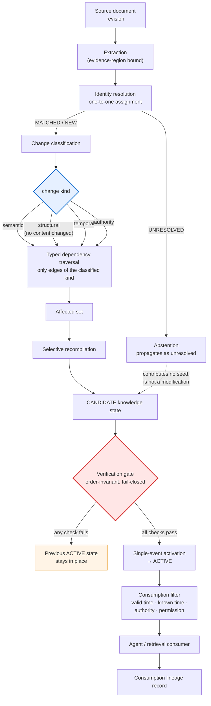
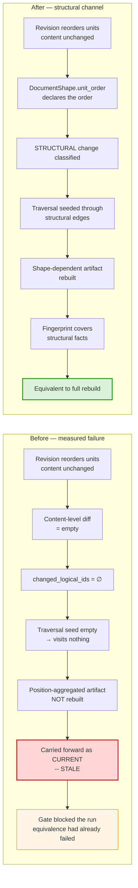
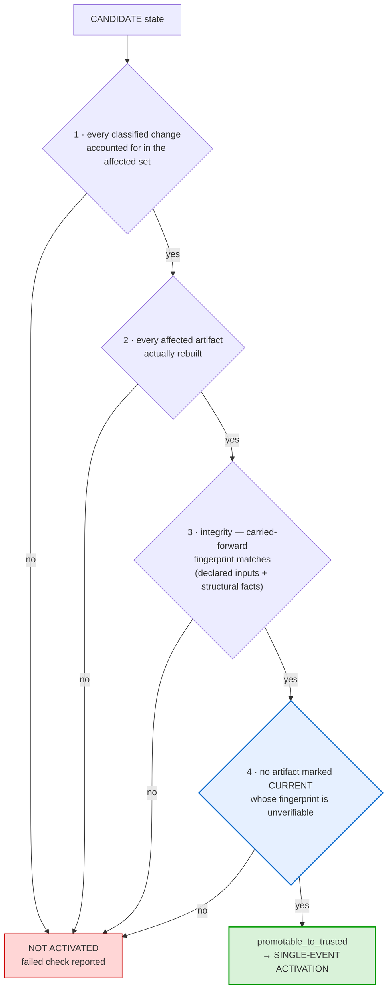
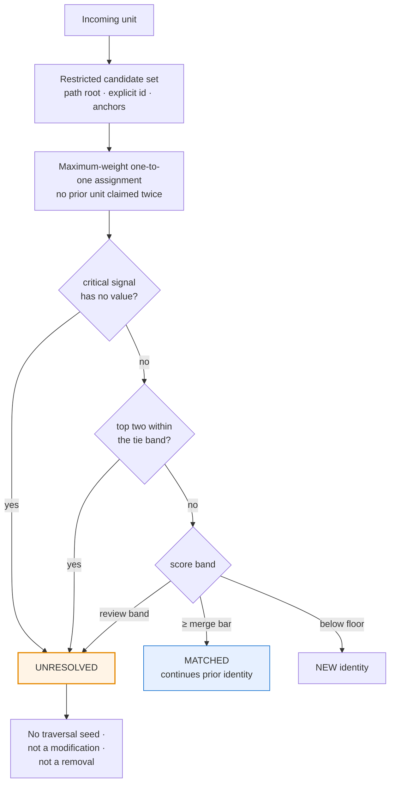
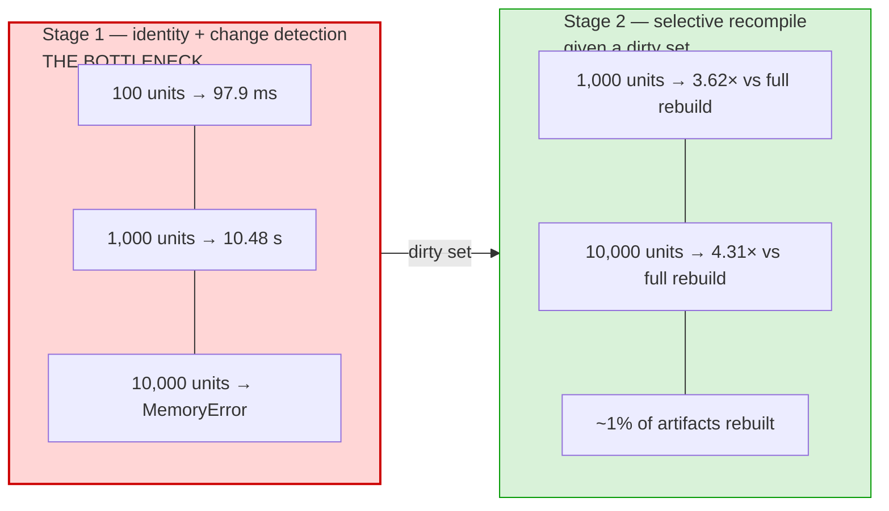
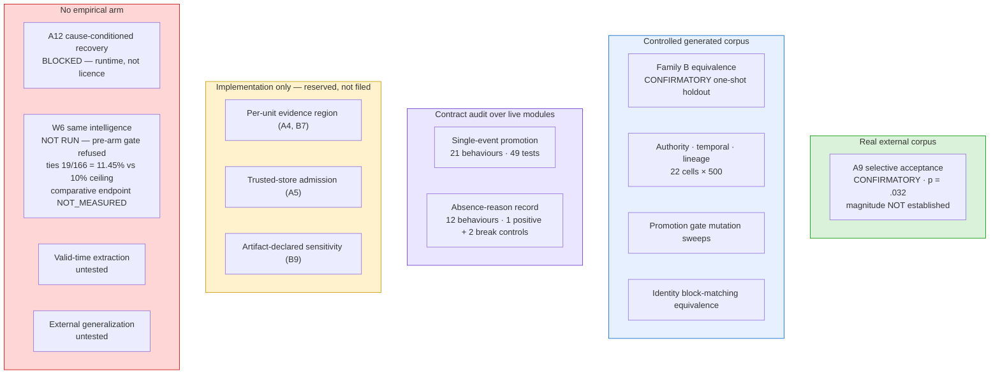
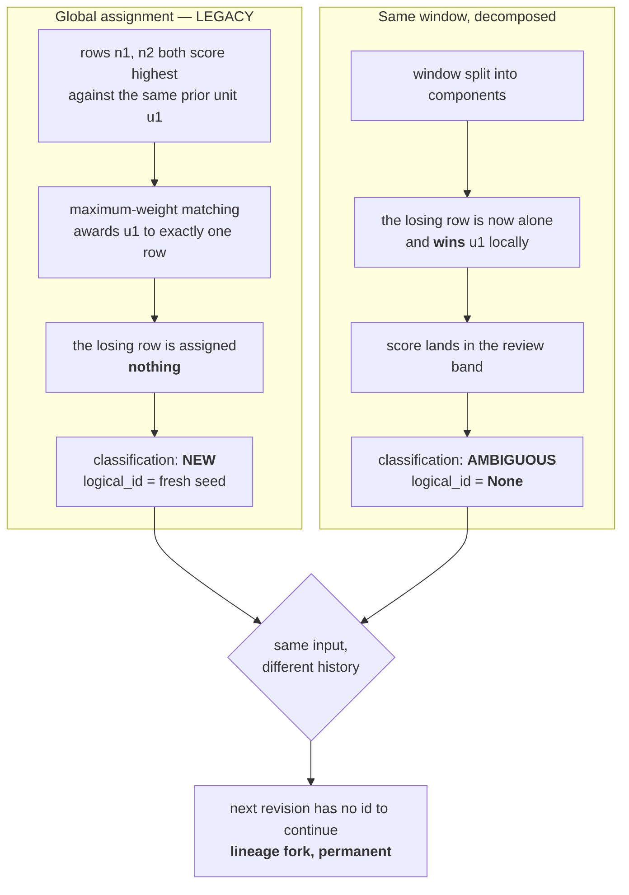

# Figures — patent and paper packages

2026-08-19. Source form for both packages. Diagrams are Mermaid so they are
diffable and reviewable; final typesetting is a venue/attorney task.

Each figure states **what it is evidence of, and what it is not**. A diagram is
not a result, and none of these may be cited as one.

---

## Figure 1 — Where staleness enters, and where it is stopped

The pipeline, with the two mechanisms that distinguish it from an incremental
build marked. Nothing reaches a consumer except through the gate.

**Evidence of:** nothing on its own — this is the architecture, not a result.
The two highlighted nodes are the elements the claim set relies on.

---

## Figure 2 — The failure this system caused, and the fix

Left: the measured defect. Right: the corrected path. This is the clearest
statement of what the invention adds over a content-hash incremental build.

**Evidence of:** the left path is receipted
(`structure-only-stale-diagnosis-2026-08-18.json`, `all_equivalent = False`,
`stale_left_behind = 2`). The right path is receipted by the fresh-seed holdout.

**Not evidence of:** that structural propagation is commonly required in
production, or that it is globally cost-effective. Neither is measured.

**Read the amber box carefully.** The gate holding is *not* a pass. Equivalence
had already been violated when it fired.

---

## Figure 3 — The gate's four checks, drawn in their implementation order

> **Caption correction, 2026-08-19.** This figure was titled "the order is a
> limitation". `H1-I` permuted all 24 orders over 6 constructed states (144
> evaluations) and found **no change in the admit/refuse verdict**, on a harness
> whose positive control diverged on 12 of 24 orders. The claim limitation was
> narrowed accordingly. The order shown is the implementation's and determines
> **which refusal is reported**, not whether one occurs — the figure must not be
> captioned as though ordering controls the outcome.
>
> Nor are the checks independent: in the no-oracle branch the integrity check's
> pass is discharged by the staleness check that follows it. They are
> order-invariant, not independent.

**What the order does and does not buy.** It selects **which failed check is
reported**, not whether activation happens: `H1-I` permuted all 24 orderings over
6 states (144 evaluations) and found no change in the admit/refuse verdict, on a
harness whose positive control diverged on 12 of 24 orders. Activation requires
every check to pass, and a conjunction is commutative.

What *is* load-bearing here is the third state. Check 4 can return
**unverifiable**, distinct from pass and fail, which a build cache does not have —
a cache hit is a pass. And a check never reached because an earlier one failed is
recorded `NOT_REACHED`, never as a pass, so a short-circuited run cannot be read
as a verified one.

**Do not caption this figure as "the order is a limitation".** It was, and the
claim was narrowed.

**Evidence of:** declaration-mutation and build-record-mutation sweeps.

**Not evidence of:** that the sealed receipt establishes the declared input set
was *complete*. It does not, and no claim says it does.

---

## Figure 4 — Identity resolution outcomes

**The asymmetry is deliberate:** a false merge rewrites a unit's history
undetectably; a false split is visible and joinable. Every ambiguous path leads
to abstention, never to a guess.

**Not evidence of:** that the bands are correct. **No threshold here is
calibrated.**

---

## Figure 5 — Cost, split into the two stages it actually has

The single most misreadable result in the package, drawn so it cannot be
misread.

**These must never be multiplied together or reported as one figure.** The
3.62×/4.31× numbers are *downstream* figures. Folding stage 1's cost into them
would hide the dominant cost inside the saving — the first objection a reviewer
should raise, and the reason the claim matrix lists any end-to-end speedup as
forbidden wording.

**Measured on:** a controlled generated corpus, single uninstrumented desktop
host. Order-of-magnitude, not a benchmark.

---

## Figure 6 — Evidence classes across the claim set

What is actually established, by class. The honest shape of the package.

**This figure is the paper's own limitations section in one image.** The Living
Knowledge claims sit in the middle boxes: mechanism correctness established,
external validity not. The contract-audit box is deliberately a separate class
from the controlled-corpus box — it audits what live modules record, not what a
corpus contains — and the amber box holds recitals supported by implementation
alone, which is why they are reserved rather than filed.

---

## Figure 7 — why accelerating identity matching broke history

**Purpose.** One figure that makes the H1-E2 veto self-evident, so a reader does
not have to take "approximation lost accuracy" on trust.

**Evidence class: CONTROLLED.** Constructed cases (`H1-K`), plus the real
consequence measured in `H1-E2` (8/8 future-path divergences).

**Caption.** Exclusivity is a global property. A unit that loses a contended
prior unit is assigned nothing and is classified NEW; the same unit, evaluated in
a smaller window, wins that prior unit and is classified AMBIGUOUS. Because an
ambiguous decision carries no logical id, the following revision seeds a fresh
identity rather than continuing the existing one — which is why 8 residual
divergences became 8/8 divergences one revision later.

**What this figure must not be drawn as.** Not a bug in the fast path. Both
branches are locally reasonable; the difference is which question was asked.

---

## Figure 8 — the identity scalability trade, including the negative result

**Evidence class: mixed, and the mixing is labelled.**

| policy | speed | exactness | status |
|---|---|---|---|
| `LEGACY` (dense global) | baseline | exact by definition | **in production** |
| `BLOCKED` (bucketed candidates) | ~47x at 1,000 units | 8 residual, 8/8 future-path divergence | **shadow only — promotion veto** |
| `CERTIFIED_SPARSE` (admissible bound + certificate) | **0.35–0.48x** | exact on frozen corpus, 3 separating mutants | **not proposed for promotion** |

**Caption.** The two axes do not trade off smoothly. The fast policy is not
merely less accurate — it produces a different history. The exact policy is not
merely less fast — it is slower than the baseline it was meant to accelerate,
because preserving the runner-up facet requires retaining `min(M, N+1)`
candidates per unit, which for similarly-sized revisions is all of them.

**Drawing rules.** `BLOCKED` must never be rendered as a successful replacement:
its speed column is real and its correctness column vetoes it. `CERTIFIED_SPARSE`
must not be rendered as a win: it is exact and slower, which is a result, not a
product. If a later exact-and-faster policy is found, it is added as a fourth row
— it does not replace this one.

---

## Figure-set integrity rules

1. No figure may assert more than its evidence class allows. A controlled result
   is drawn as controlled.
2. Single-event promotion is drawn as **enumerated refusal and single-event
   activation** — never as a distributed transaction guarantee.
3. The 28-pair Wikipedia result is drawn as *one source family, retrospective*,
   never as arbitrary-document generalisation.
4. `NOT RUN` and `BLOCKED` items appear in the evidence map with those labels
   rather than being omitted, because omitting them is what makes an evidence map
   flattering instead of honest.

